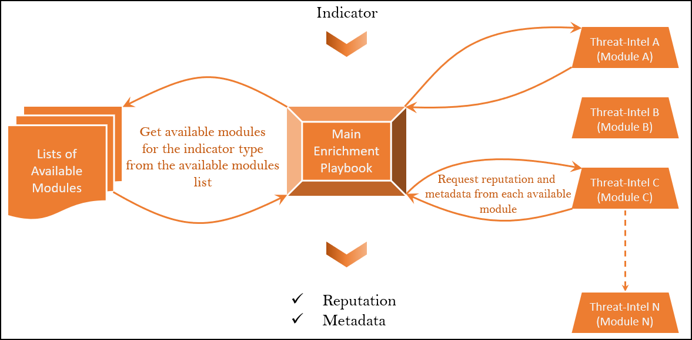

# Architecture



**Compatibility:** 7.2+

# Referenced Playbooks (Modules)
At least one referenced playbook is required per indicator type. the playbook only function is to fetch threat intelligence data from one Cyber Threat Intelligence (CTI) provider and compile the results as described in the return values sections below.
If you want to contribute a reference playbook for a new CTI you should follow the below specifications:

## Parameter:
The playbook has only one input parameter :**artifact** which is a the artifact value to rate

## Enrichment TAG:
- Indicator type Tag: **[INDICATOR TYPE]_Enrichment**, the available tags would be:
    - IP_Enrichment
    - URL_Enrichment
    - Domain_Enrichment
    - Email_Enrichment
    - Hashcode_Enrichment (which includes md5/sha1/sha256)
    - Host_Enrichment
    - Domain_Enrichment  
    - File_Enrichment  
    - Port_Enrichment   
    - Registry_Enrichment  
    - Process_Enrichment  

## Return Values
The playbook must have the last step as **SET VARIABLE** with the below variables defined:
**cti_name**: The CTI source, exp: FortiGuard
**cti_score**: Integer representing the artifact repuation as described in the table below

| Reputation Value | Description |
| --- | ----------- |
| 0 | indicator is good |
| < threshold  | indicator is Suspicious |
| >= threshold  | indicator is Malicious |

**ioc_attributes**: is a JSON dictionary with all the attributes you want to use for enrichment, the syntax is as follows:
```json
{"Indicator_attribute1":"Enrichment Value1","Indicator_attribute2":"Enrichment Value2"...etc}
```
so for example if the attribute country is to be populated from the current referenced playbook the syntax would be:

```json
{"country":"Canada"}
```
The attribute name must be exactly as defined in FortiSOAR module, you can check it by browsing to *Settings > Modules* Select Indicator then the field you are looking for. the field name would be as defined by *Field API Key*

Example: 


**enrichment_data**: a JSON object with the list of tables holding the threat intel details as per the below example:

```json
[
    [
        "Table 1 Title",
        {
            "key1": "value1",
            "key1": "value1",
            "key1": "value1",
            ...etc                
        }
    ],
    [
        "Table 2 Title",
        {
            "key1": "value1",
            "key1": "value1",
            "key1": "value1",
            ...etc                
        }
    ]
    ...etc
]
```


in summary, to add a referenced enrichment playbook for any indicator type, it would be enough to return the 3 variable above and adding the appropriate tag to the playbook then reset the list of available playbooks with the playbook **Update Indicator Enrichment Global VARs**

# Update Indicator Enrichment Global VARs Playbook:

The first time the main playbook runs it will initialize the list of available modules (unitary enrichment playbooks modules). Each time a new enrichment module playbook is added or removed this playbook has to be executed to update the list of available enrichment playbooks for each indicator type. It does it by reading the IRIs of all enrichment playbooks by type, then store each list in a global variable as CSV.
The result would be a global variable such as:
- **IP_Enrichment_Playbooks_IRIs** with the value:
    - /api/3/workflows/30c2465a-29a6-424b-a3ff-8080d269f422,/api/3/workflows/6a90a0b7-5b49-4774-ae2d-455409b77ea5,/api/3/workflows/9da329ef-7b8e-44ec-aed1-1cd41f9bd1a8,/api/3/workflows/a6a92cc5-1934-41c6-a608-8510d38c4dbc

# Primary Playbook: 

The playbook **Indicators Enrichment - Modular** runs with the OnCreate trigger for each indicator. It fetches the list of available referenced playbooks for the current indicator type and runs them in a loop to get the threat intel data from each. The data is then compiled to determine the indicator reputation, description and all the fields defined by the **ioc_attributes** variables from each executed referenced playbook.


# Currently Supported Indicators Types:

### IP Address


### URL


### Hashcode (md5/sha1/sha256)


### Domain


### Email


# Deployment:

## Manual Installation:

- Download the repo's zip from this page, click on: Code > Download ZIP and save the ZIP file to your workstation
- Open FortiSOAR Content Hub
- Click on the Upload button and select Solution Pack, drag and drop the zip file you downloaded

## Automatic Installation:
 
- Install it directly from the Content Hub

